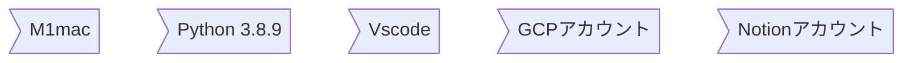

### 前書き
Notionは自己管理やスケジュールを組んだり、他者と資料を共有したりと

とても便利で、使い始めて１年ぐらい経ちました。

定期的なアップデートや大型の資金調達もされたなどのニュースから注目されるであろうし

今年もかなりお世話になっていくだろうなと感じてます。

[NotionAPI](https://developers.notion.com)が試験的に導入されたのは去年の大きな出来事で

snsでも喜びと期待の声が多く上がっていたと覚えています。

いろんな記事を参考にさせてもらっていますので

自分でもこんなことができるようになりましたよ、という報告でつらつら書いていこうと筆を取りました。

至ってシンプルな記事ですのでかるーく読み流して、ちょっとでも生活のアクセントになれば嬉しいです。

:::message
筆者は職業エンジニアではありません
:::

## 記事のきっかけ

豊富なコンテンツを全部Noitonで一括管理したいと思っています。

GoogleSpreadsheetやpdf,imageはデフォルトで埋め込みができ

[apption.co](apption.co/)や[automate.co](https://automate.io)、[pipedream](https://pipedream.com/)などを使えば活用の幅は広がります。

RSSで情報発信をしている企業もまだ多いので上記のオートメーションツールを使って

Notionへ情報を溜めていくことはできそうです。

方法は色々あるんですが、今回は以下のように進めることにしました。

GCPでの定期実行まで書くとボリューム多すぎるので、前半と後半に分けて書きます。

## 記事の内容

A. [RSS情報をpythonで取得し、](#RSS情報をpythonで取得)
B. [NotionAPIを通してnotionへ保存](#NotionAPIを通してnotionへ保存)
C. [pythonコードをGCPで定期実行させる](#pythonコードをGCPで定期実行)

### 開発環境


できるだけ丁寧にわかりやすく書こうと思いますので長文になりますがご了承ください。

では、参りましょう。

## RSS情報をpythonで取得

::: message
すでにローカル環境にpython3がインストールされている前提で進めます。
インストールでお困りの方はググるとたくさん記事があります。
:::

##### 0. 空のフォルダを用意して、それをvscodeで立ち上げます。


##### 1.python 仮想環境と必要なモジュールを用意

ターミナルを開き`python3 -m venv venv` で仮想環境を準備し、`source venv/bin/activate.fish` で仮想環境に入ります。
筆者の普段使いがfishなので、bashやzshの場合は`source venv/vin/activate`にしてください。

main.pyファイルを作成


`pip install feedparser`でrssをつかむモジュールと
`pip install requests `でnotionへ通信するためのモジュールをインストール
`pip freeze > requirements.txt `でrequirements.txtを書き出します


##### 2.RSS取得コード実装

今回は[こちらのページ](https://59log.com/?func=detail&id=2852)の国際カテゴリのRSSを取得します

他のRSSを利用したい場合はurlを変更し、要素を確認して行ってください。

```python
import feedparser

# Googleニュース 国際カテゴリ
url = 'https://news.google.com/rss/topics/CAAqJggKIiBDQkFTRWdvSUwyMHZNRGx1YlY4U0FtcGhHZ0pLVUNnQVAB?hl=ja&gl=JP&ceid=JP:ja'

def job(url):
    elements = feedparser.parse(url)
    for entry in elements.entries:
        print(entry.title)
        print(entry.title_detail)
        print(entry.published)
        print(entry.link)
        break
        
job(url)

```
要素の１つ目だけわかれば良いので、今回はbreakを入れました。

printで出力されたのはこちらです。


要素のtitleとリンクと日付をNotionへ飛ばすことにします。

Notionへ渡すための次のコードです。

```python
import feedparser

import time
import datetime

# Googleニュース 国際カテゴリ
url = 'https://news.google.com/rss/topics/CAAqJggKIiBDQkFTRWdvSUwyMHZNRGx1YlY4U0FtcGhHZ0pLVUNnQVAB?hl=ja&gl=JP&ceid=JP:ja'

def job(url):
    elements = feedparser.parse(url)
    for entry in elements.entries:
        title = entry.title
        date = entry.published
        date = datetime.datetime.strptime(str(date), '%a, %d %b %Y %H:%M:%S %Z').strftime('%Y-%m-%d %H:%M')
        link  = entry.link       
        addContent(title, date, link)
        time.sleep(1)
        
job(url)

```
ここでしていることはrssで取得したpublishedを日付型に変更しました

また、addDontentはnotionデータベースに追加する関数ですがこれから作成します

ここまでがrssを取得するまでのコードです


## NotionAPIを通してnotionへ保存

##### 3.NotionAPIを作成

NotionのAPIを使うためには設定が必要ですのでそれを行なっていきます。

[Notion](https://www.notion.so/ja-jp/product?utm_source=google&utm_campaign=14877655427&utm_medium=125922091617&utm_content=552465064290&utm_term=notion&targetid=aud-1053779029641:kwd-312974742&gclid=Cj0KCQiAraSPBhDuARIsAM3Js4rnx0GgDGil6EgPEfdsaqoWEaNrj1_bzj4o5RtCUMxNb7uvWMGZctwaAm_iEALw_wcB)は無料で十分使えるコンテンツなので私も周りの人におすすめしています。

NotionAPIは[こちら](https://developers.notion.com)から登録をします。

初回登録についてはややこしい点など何もないので割愛します。

登録後は右上に出ているでしょうMy integrationsをクリックし作成開始です。


自分の場合はすでにAPIをいくつか作成しているのですが初回であるとまだ何もない状態のはずです。

**+ New intergration**をクリックします。


好きな名前を入れて、アイコンを変えたいのであればimageをアップロードしてください。

他はデフォルト設定のままで、下までスクロールし、submitをクリックしましょう。


submit後の画面でアクセストークンが発行されます。

後ほど使いますので、クリップボードなどに保存しておきましょう。

余談: [clipy](https://github.com/Clipy/Clipy)はとても便利です。スニペット登録もできるので重宝しています。


##### 4.Notionページを作成

rssをペーストするためのNotionページを作成します

自分のNotionの好きなページで`/data`と打ち、Table database - Full pageを選択


タイトルは好きにつけてもらって良いです

tableのheadはrss側に合わせます

title date link の３つの要素です

title は **text** date は **date** link は **url**

それぞれ設定します。

Numberやselectもできます。その際は[こちら](https://developers.notion.com/reference/database#property-object)の対応表を確認してカスタマイズしてください。


右上の・・・をクリックし、copy linkをクリックします。

または、webブラウザでNotionを開いている場合はそのurlをコピー、もしくは右上のshareを押してcopy linkをクリック。


すると下のようにとれると思います。


https://www.notion.so/アカウント名/{**英数字**}?v=============

赤線を引いた英数字の部分がデータベースIDとなりますのでここをコピーしておきます。


##### 5.作成したAPIとnotionページを連携しましょう

notionページのshareからinviteをクリックし、作成したAPIを追加します


これでNotionの設定は終わりです。


##### 6.Notionへpushするコード

下のコードへこれまでに獲得した**アクセストークン**と**データベースID**を貼り付けます。

引数をリテラルに書いたテスト関数を実行させてみます

```python

import requests, json

def addContent(title, date, link):
    
    token = '作成したアクセストークンを貼り付けてください'
    databaseId = '取得したデータベースIDを貼り付けてください'
    
    headers = {
        "Authorization": "Bearer " + token,
        "Content-Type": "application/json",
        "Notion-Version": "2021-05-13"
    }

    notionUrl = 'https://api.notion.com/v1/pages'
    addData = {
        "parent": { "database_id": databaseId },
        "properties": {
            "title": {
                "title": [
                    {
                        "text": {
                            "content": title
                        }
                    }
                ]
            },
            "date": {
                "date": 
                    {
                        "start": date
                        }
            },
            "link" : {
                "url": link
            }
    }
    }
    
    data = json.dumps(addData)

    response = requests.request("POST", notionUrl, headers=headers, data=data)
    print(response)

addContent('テスト関数です', '2022-01-21 17:12', 'https:www')

```
`addContent('テスト関数です', '2022-01-21 17:12', 'https:www')`の結果

Notionへ投稿されることが確認できました。


少し修正を加えて下記が今回実装するコード全文です。

例のごとくアクセストークンとデータベースIDの貼り付けは各自でお願いします。

```python
import feedparser
import requests, json

import time
import datetime


def addContent(title, date, link):
    
    token = '作成したアクセストークンを貼り付けてください'
    databaseId = '取得したデータベースIDを貼り付けてください'

    headers = {
        "Authorization": "Bearer " + token,
        "Content-Type": "application/json",
        "Notion-Version": "2021-05-13"
    }
    notionUrl = 'https://api.notion.com/v1/pages'
    addData = {
        "parent": { "database_id": databaseId },
        "properties": {
            "title": {
                "title": [
                    {
                        "text": {
                            "content": title
                        }
                    }
                ]
            },
            "date": {
                "date": 
                    {
                        "start": date
                        }
            },
            "link" : {
                "url": link
            }
    }
    }
    
    data = json.dumps(addData)

    response = requests.request("POST", notionUrl, headers=headers, data=data)
    print(response)
# Googleニュース 国際カテゴリ
url = 'https://news.google.com/rss/topics/CAAqJggKIiBDQkFTRWdvSUwyMHZNRGx1YlY4U0FtcGhHZ0pLVUNnQVAB?hl=ja&gl=JP&ceid=JP:ja'

def job(url):
    elements = feedparser.parse(url)

    for entry in elements.entries:
        title = entry.title
        date = entry.published
        date = datetime.datetime.strptime(str(date), '%a, %d %b %Y %H:%M:%S %Z').strftime('%Y-%m-%d %H:%M')
        link  = entry.link       
        addContent(title, date, link)
        time.sleep(1)
        
job(url)

```
実行結果はざっと60行ぐらいのデータが追加されました。


ここまでで、かなり活用の幅が広がりそうではないでしょうか。

これは単純なコードですが色々カスタマイズを見込めて楽しいと思います。

定期実行の仕方になりますが、ちょっと長くなりすぎたのでここで終了とします。

最後までお付き合いありがとうございました。

## pythonコードをGCPで定期実行

...to be continued